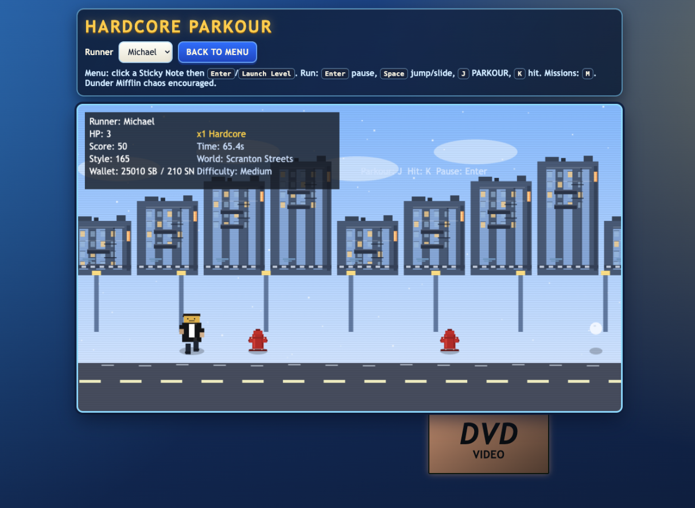

# Hardcore Parkour

Playable vertical-slice prototype built from the project game plan.

## Current UI


## Run
Because this is a browser game using modules, serve the folder with a local web server:

```bash
cd /Users/Joseph/Code/Games/Hardcore\ Parkour
python3 -m http.server 8000
```

Open `http://localhost:8000`.

## Prototype features
- Conference Room level-select scene with Polaroid world cards
- Scene system: `menu`, `run`, `shop` (placeholder), `annex` (placeholder)
- Persistent save scaffold (`localStorage`) for world unlocks, currencies, and achievements
- Auto-runner physics loop with jump, hold-to-slide, and hit action
- 0.2 second landing shout window (`J`) for HARDCORE boost
- Character differences for Michael, Dwight, and Andy
- End-of-level "Performance Review" with stars and currency rewards

## Next implementation targets
- Break Room shop item catalog + buy logic + Jim/Pam gating behavior
- Warehouse stealth mission to unlock Jim's Desk Key / shop top row
- Annex outfit equip flow + Kelly comments + Dundie shelf UI
- Real level data files, cutscenes, and finale boss encounters
